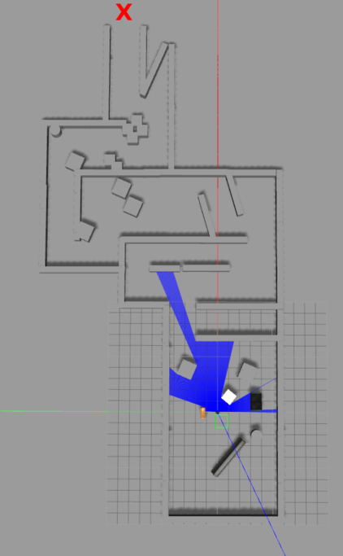
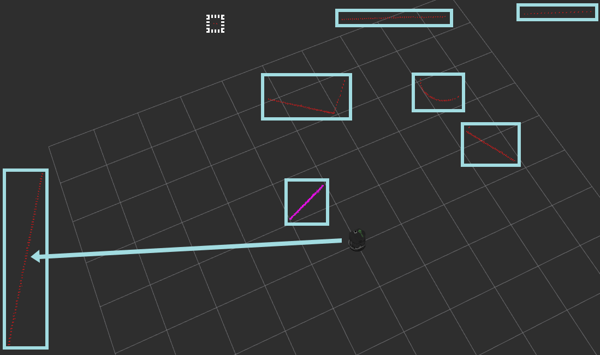
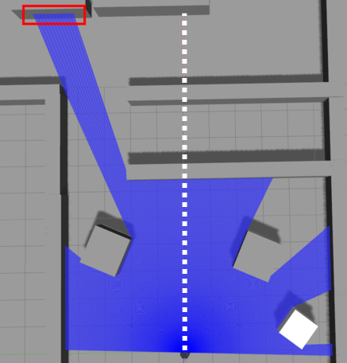

# Maze Project

The purpose of this project is to enable a robot to compete in the Maze Challenge. 
In this challenge, a turtlebot must independently find outside a previously unknown maze. 
For maze wall and object recognition, a Hokuyo Laser Scanner is mounted to the turtlebot.
The project is developed in Python language, using the Robot Operation System (ROS).

## Table of Contents

- [Getting Started](#getting-started)
    - [Prerequisites](#prerequisites)
        - [Native ROS on your System](#native-ros-on-your-system)
        - [Turtlebot and Git](#turtlebot-and-git)
        - [Mount Hokuyo Laser Scanner onto the Turtlebot](#mount-hokuyo-laser-scanner-onto-the-turtlebot)
        - [Create Catkin Workspace](#create-catkin-workspace)
    - [Install the Project](#install-the-project)
        - [Clone and build the Project Repository](#clone-and-build-the-project-repository)
    - [Run the Project](#run-the-project)
        - [Prepare Gazebo and Run the Project](#prepare-gazebo-and-run-the-project)
- [Project Goal](#project-goal)
- [Functional Principle](#functional-principle)
    - [Search and Approach Wall](#search-and-approach-wall)
    - [Follow Wall](#follow-wall)
    - [Circle Detection and Repositioning](#circle-detection-and-repositioning)
    - [Follow Wall Direction Heuristic](#follow-wall-direction-heuristic)
- [Author](#author)
- [Acknowledgments](#acknowledgments)
    - [Ivmech PID Controller](#ivmech-pid-controller)
        

## Getting Started

These instructions will guide you step by step how the get this project running on your machine.

### Prerequisites

Instructions in order to satisfy the prerequisites for installing the project.

#### Native ROS on your System

**Warning! Please use Ubuntu 16.04 as this is the Long Term Support Version (LTS). If you are using Ubuntu 17.04 you have to use ROS Lunar release on your own risk!**

* Goto http://wiki.ros.org/kinetic/Installation/Ubuntu and follow the instructions there. The installation can take some time depending on your internet connection.

#### Turtlebot and Git

* Install git and the turtlebot:

```
sudo apt-get update
sudo apt-get install git
sudo apt-get install ros-kinetic-turtlebot-simulator
```

#### Mount Hokuyo Laser Scanner onto the Turtlebot

With the following instructions the Hokuyo Laser Scanner is mounted on the Turtlebot. 
After following these instructions, you should be able to visualise the laser ray projections in gazebo, 
and you will have a new stable topic that gets the laser data from the new scanner, which is `/laserscan`. 

**The Hokuyo Laser Scanner has a range of 30 m and a forward field of vision of 180 degrees.**


* Delete the existing `turtlebot_description` package using the following commands:
  ```
  cd /opt/ros/kinetic/share
  sudo rm -r turtlebot_description
  ```

* Download the modified `turtlebot_description` package from this [link] (https://fbe-gitlab.hs-weingarten.de/mat-iki/amr-mat/blob/master/turtlebot_hokuyo/turtlebot_description.tar.gz) to your `Downloads`
  folder. Extract the package from the compressed file.

* Move the extracted package from the `Downloads` folder to the location of the deleted package using the following commands:
  ```
  cd ~/Downloads
  sudo mv turtlebot_description /opt/ros/kinetic/share
  ```
  If everything went alright, there should be a file named `hokuyo_urdf.xacro` at the location `/opt/ros/kinetic/share/turtlebot_description/urdf/sensors`

* Run the following commands to setup the new modified turtlebot as the default whenever you launch it in gazebo:
  ```
  echo "export TURTLEBOT_3D_SENSOR=hokuyo" >> ~/.bashrc
  source ~/.bashrc
  ```
  Note that by doing this, the turtlebot will be launched with hokuyo laser scanner everytime you launch `turtlebot_gazebo`. If you want to go back to how everything was before you did all this, just delete
  the `export TURTLEBOT_3D_SENSOR` line in the `.bashrc` file.


#### Step 3 Create Catkin Workspace

All your ROS packages must be stored in a special folder called __catkin workspace__.
ROS uses the [catkin](http://docs.ros.org/api/catkin/html/) build system to manage your codebase.

* Create your workspace with the following instructions:

```
mkdir -p ~/catkin_ws/src
cd ~/catkin_ws/src
catkin_init_workspace       #initiates the catkin workspace
cd ~/catkin_ws
catkin_make                 #compiles the catkin workspace
echo "source ~/catkin_ws/devel/setup.bash" >> ~/.bashrc
source ~/.bashrc
```

### Install the Project 

Instructions about how to install the project onto your machine.

#### Step 4 Clone and build the Project Repository

* Clone the project into the catkin workspace and build it:

```
cd ~/catkin_ws/src
git clone git@fbe-gitlab.hs-weingarten.de:stud-amr-ws2017-master/nv-171738_tier4.git
catkin_make
```

### Run the Project

Instructions about how to run the project on your machine.

#### Step 5 Prepare Gazebo and Run the Project

* Launch the simunlation environment gazebo, load a maze into gazebo and launch the project package (nv_171738_maze).
```
roslaunch turtlebot_gazebo turtlebot_world.launch
rosrun gazebo_ros spawn_model -file ~/catkin_ws/src/nv-171738_tier4/maze_practice/model.sdf -sdf -model -maze -x 16 -y 5
roslaunch nv_171738_maze maze.launch
```

## Project Goal

The goal of this project is to escape out of a previously unknown maze.
The robot spawns somewhere inside this maze and must leave it without bumping against a wall or any other object.
It is not necessary for the robot to stop once it left the maze.

Below is a screenshot showing an example maze. The goal is depicted as a red cross.



## Functional Principle

This section describes the internal algorithms used in this project.

### Search and Approach Wall

#### Summary:

Evaluate the laser data to find the best suitable wall, turn the robot in its direction, approach it and stop in front of it.

#### Steps:
1. Get laser data from topic `/laserscan` 
1. Classify connected data points in single sublists. Each sublist contains a list of distance values and the original index value of the first entry (offset). 
Connected data points are determined based on a threshold of their distance from each other.

The image below shows an example of classified data points marked with a frame.
Notice that small data points groups smaller than 20 are ignored by further algorithmns (marked by white dotted frame).



1. Calculate the relative index of the first element (regarding all laserscan values), 
average (arithmetic mean) and standard deviation of each data point group and add to list.
1. Choose list with preferably most elements, furthermost average distance and lowest standard deviation.
This approach makes it very likely that a data point group referring to a wall instead of another object is chosen.
1. Get absolute index of the middle point from the chosen data point group.
1. Calculate the required rotation of the robot in degree to face this middle data point.
1. Let the robot rotate based on `/odom` quaternion data. The quaternion data must be converted into degree for doing so.
1. Approach the wall until a threshold distance from the wall is reached, then stop.


### Follow Wall

#### Summary:
The robot must detect and follow the wall. It must circuit any object on its way. Further it must retain the same distance to the wall/obstacles by using a PID controller. 

#### Steps:

**Follow wall or other elements until obstacle in front:**
1. Split the laser data into equal sized groups. 
Then determine the *target group* based on the wall follow direction (left/right) and get its minimum distance to an object (wall/obstacle).
1. Initialize the PID controller with the desired wall distance set point. 
Let it then determine the control variable by updating it with the current minimum object distance value. 
The control variable is then used for the robot rotation. The forward robot speed is a constant value.


**Align the robot when obstacle is in front:**
1. Get laser values from the middle and determine the minimum distance of the closest object in front of the robot.
1. Align the robot when an obstacle is closer than the desired wall distance.
First split the laser data into equal sized groups and determine the target group based on the wall follow direction. 
Then determine the index of the group with the smallest average distance and also the previous and current average distance of the target group.
In order to achieve an approximately 90° angle to the obstacle, 
let the robot rotate until the index of the smallest group equals the index of the target group and the previous average distance of the target group is bigger than its current average distance.


### Circle Detection and Repositioning

#### Summary:
It may happen that the robot follows a wall/object which is isolated from the remaining maze, thus letting the robot move in circles and making it unable to leave the maze. 
The circle detection recognizes this and lets the robot move to a disconnected part of the maze.

#### Steps:

1. Save absolute robot position based on `/odom` data in a list whenever the robot enters the *Follow Wall* phase.
1. Continuously check the current robot position with the saved position points. A margin must be added to the saved data points for easing detection.
1. Ensure that the robot is not immediately detected but has to leave the saved position point first.
1. If a circle is detected, turn the robot 45° away from the current following wall/object and goto phase *Search and Approach Wall*


### Follow Wall Direction Heuristic

#### Summary:
To figure out whether the robot should initially follow the wall to the left or the right a simple heuristic can be used.
The laser data is split in the middle into two groups. The robot will then follow the direction of the group with the biggest maximum value.

#### Steps:

1. Split laser data into two groups and get their maximum value.
1. Set the wall follow direction according to the group with the biggest maximum value.

In the image below you can see the maximum value in the left group, therefore the robot will initially follow the wall to the left.



## Author

* **Nico Vinzenz** (*nv-171738*)

## Acknowledgments

External code is acknowledged in this section.

### Ivmech PID Controller

* Author: **Caner Durmusoglu**

* File: PID.py

* [Github Repository](https://github.com/ivmech/ivPID)